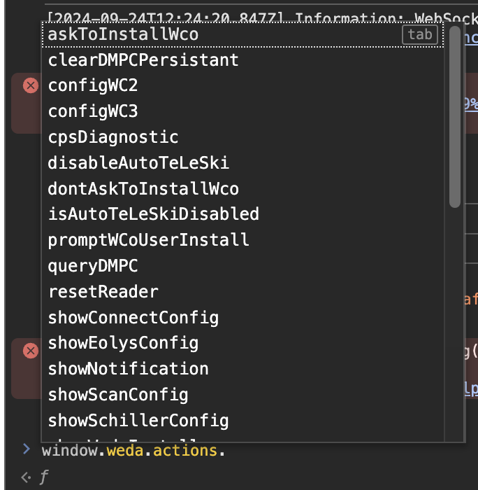

# FW - scripts

FW pour "Fonctions Weda"

Voici un petit tuto pour utiliser une fonction weda tout d'abord allez sur secure, ouvrez une console commencez a taper : `window.weda.`.

L'auto-complétion sera proposée par le navigateur.

### exemple



# Variables
Des variables ont été ajoutées pour savoir si weda a activé certaines fonctionnalités.

dans `window.weda.wedaHelper` :

- courbesPediatrie
- historiqueConsultation

dans `window.weda.capabilities`:

- hasDmp
- hasCda
- hasInterop
- hasWedaConnect
- hasNotifications
- hasSegur
- etc ...

*Feel free to do something with it* (on ne peut pas les modifier).

Dans `window.weda.actions` nous avons tout un tas de fonctions, notamment le `sendNotification()` (qui permet d'envoyer des notifications ... toujours utile ... *feel free to do something with it*).

En revanche il est difficile d'envoyer des notifications avec des messages customs dans le cadre de l'extension chrome (donc un fichier .js par notification).

Pour utiliser un fichier "FW", voici un example :

```js

// content script

function useFWScript() {
    var script = document.createElement('script'); // nouvelle balise 
    script.src = chrome.runtime.getURL('FW_scripts/FWData.js'); // feed
    (document.head || document.documentElement).appendChild(script); // applique

    // une fois l'enfant ajouté, le script va s'exécuter automatiquement.
    // il n'est malheureusement pas possible de le rendre réutilisable
    // donc il faudra ajouter un script par notification.

    // ajouter la fonction dans un "script.innerText" n'est pas possible
    // car on trigger les sécurités du navigateur.

    // si notre script doit retourner des valeurs on vient l'intercepter
    // avec un event Listener
    window.addEventListener("message", function(event) {
        console.log(event);
        if (event.source === window && event.data.type === "FROM_PAGE") {
            console.log("Données depuis la page : ", event.data.payload);
        }
    });
}
```

FWData.js associé:

```js
let weda = window.weda || {};

let infos = {
    wedaHelper: weda.wedaHelper,
    capabilities: weda.capabilities
}

// partie optionnelle (seulement si on veut renvoyer des infos)
window.postMessage({
    type: "FROM_PAGE",
    payload: infos
}, "*");
```

Je préfère ne pas m’avancer sur l'implementation final. mais voici le concept pour récupérer les valeurs mise a dispositions par WEDA pour ne pas avoir de features en doublons.

Par la meme occasion vous avez access au fonctionnalités du support pour reset / configurer les déférents composant de weda ;).